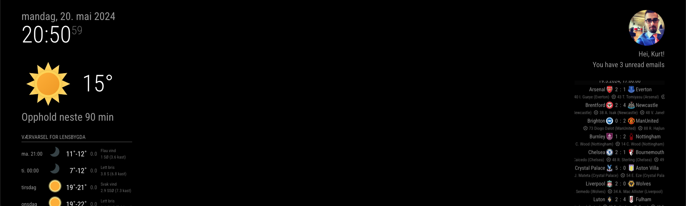

# MMM-GmailNotifier
MMM-GmailNotifier is a MagicMirror module that displays the user's Gmail profile picture and name, and checks for unread emails in the inbox. The profile picture is automatically shown if there are any unread emails.
```
Features
   - Displays the profile name and profile picture from the Gmail account.
   - Shows the number of unread emails.
   - Automatically hides email notifications if there are no unread emails.

```


### Screenshot




### Installation
Follow these steps to install and configure MMM-GmailNotifier:

### 1. Clone the Repository
```
cd ~/MagicMirror/modules
git clone https://github.com/yourusername/MMM-GmailNotifier.git
cd MMM-GmailNotifier
```


### 2. Install Dependencies
```
  npm install
```

### 3. Configure Google API

1. Go to the Google Cloud Console.
2. Create a new project or select an existing project.
3. Navigate to "API & Services" > "Library" and enable the following APIs:
 - Gmail API
 - Google People API
4. Go to "API & Services" > "Credentials" and click on "Create Credentials".
5. Select "OAuth client ID".
6. Configure the OAuth consent screen if you haven't already.
7. Select "Desktop app" as the application type.
8. Download the OAuth 2.0 Client ID JSON file and note down the client_id and client_secret.

### 4. Update the Configuration File
```javascript
{
    module: "MMM-GmailNotifier",
    position: "top_right", // Choose your desired position
    config: {
        clientId: "YOUR_CLIENT_ID",
        clientSecret: "YOUR_CLIENT_SECRET",
        userName: "Your Name"
    }
},
```
### 5. Authorize the Application
1. Start MagicMirror:
```
npm start
```
2. Follow the instructions in the console to authorize the application. You will be prompted to visit a URL to grant permissions.
3. Copy the authorization code from the browser and paste it into the console.

### Directory Structure
```
MMM-GmailNotifier/
├── node_helper.js
├── MMM-GmailNotifier.js
├── package.json
└── README.md
```
### Updates
Keep the module up-to-date by pulling the latest changes:
```
cd ~/MagicMirror/modules/MMM-GmailNotifier
git pull
npm install
```
### Troubleshooting
If you encounter any issues, check the MagicMirror logs for error messages:
```
pm2 logs mm
```
For more details or questions, you can open an issue on the GitHub repository.

### License
This project is licensed under the MIT License. See the LICENSE file for details.


